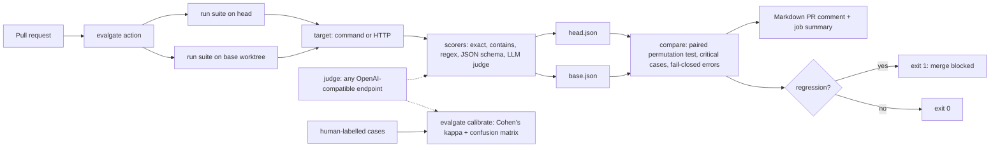

# Evalgate

**Blocks the merge when your agent gets worse.** On the bundled toy agent, a bad prompt change drops the mean score 1.000 → 0.500 (paired permutation p = 0.0313) and the gate fails; the LLM judge agrees with human labels at Cohen's κ = 1.000 on 16 cases (qwen3.8:27b, local, small author-labelled set).

## What it does

- Declares an eval suite in YAML: cases, a target, and scorers. Unknown keys, duplicate ids, bad regexes and bad JSON Schemas are rejected before any target runs.
- Runs the agent as a command (stdin to stdout) or an HTTP endpoint.
- Scores with deterministic scorers (exact, contains, not-contains, regex, JSON Schema) and an LLM judge served by any OpenAI-compatible endpoint.
- Runs the suite on the PR base and head, then gates on a significance threshold (one-sided paired permutation test), critical cases, and fail-closed errors.
- Posts a Markdown score-diff comment on the pull request and writes it to the job summary.
- Calibrates the judge against human labels with Cohen's kappa and a confusion matrix.

## Architecture



## Quickstart

Local (Node 24, pnpm 9):

```bash
pnpm install && pnpm build
node dist/cli.js run examples/toy-agent/evalgate.yaml --out .evalgate/base.json
TOY_AGENT_VARIANT=regressed node dist/cli.js run examples/toy-agent/evalgate.yaml --out .evalgate/head.json
node dist/cli.js compare --base .evalgate/base.json --head .evalgate/head.json --comment .evalgate/comment.md   # exits 1
```

Docker:

```bash
docker compose run --rm test       # unit tests in a container
docker compose run --rm example    # base vs regressed demo, exits 1 (expected)
```

GitHub Action (`.github/workflows/evalgate.yml`):

```yaml
name: Evalgate
on:
  pull_request:
permissions:
  contents: read
  pull-requests: write
jobs:
  evals:
    runs-on: ubuntu-latest
    steps:
      - uses: actions/checkout@v4
        with:
          fetch-depth: 0 # base commit must be available for the base worktree
      - uses: ./   # in your repo: <owner>/evalgate@v0.1
        with:
          suite: examples/toy-agent/evalgate.yaml
```

The comment is created once and then edited in place: `evalgate comment` finds it by its `<!-- evalgate -->` marker, so other bots' comments are never overwritten ([ADR-0008](docs/adr/0008-pr-comment-upsert-by-marker.md)). That needs `pull-requests: write`; on a fork PR with a read-only token the step prints a warning and the job still reports the gate result. The base checkout is a temporary git worktree that is cleaned up before and after each run, so the action also works on self-hosted runners.

| Input | Purpose |
| --- | --- |
| `suite` | Suite YAML path (required) |
| `base-ref`, `base-setup` | Ref to compare against; command to run in the base checkout first |
| `min-delta`, `alpha`, `case-threshold` | Override the suite's `gate` |
| `head-target-url`, `base-target-url` | For `http` targets: the head and base deployments (passed as `--target-url`) |
| `comment`, `github-token` | Post the PR comment; the token to use |

Post a comment yourself: `GITHUB_TOKEN=... evalgate comment --repo owner/name --pr 12 --body-file .evalgate/comment.md [--api-url url]`.

## Suite format

```yaml
name: toy-support-agent
target:
  type: command            # or: http (url, headers, inputField, outputPath)
  command: node
  args: [agent.mjs]
gate:
  minDelta: 0.02
  alpha: 0.1
  caseThreshold: 0.5
cases:
  - id: refund-window
    input: "How long do I have to get a refund?"
    critical: true         # any regression fails the gate
    scorers:
      - { type: contains, value: "30 days" }
```

| Scorer | Passes when |
| --- | --- |
| `exact` | Trimmed output equals `value` (case sensitive by default) |
| `contains` | Every substring in `value` appears (case-insensitive by default) |
| `not-contains` | No substring in `value` appears |
| `regex` | `pattern` (with `flags`) matches the output |
| `json-schema` | Output (or its first fenced json block) is JSON that validates against `schema` |
| `llm-judge` | The judge replies `{"verdict":"pass"}` for the `rubric` |

A case score is the mean over its scorers and repeats. A target crash, timeout or unparseable judge reply makes the case an `error` (score `null`), never a 0.

## The gate

`evalgate compare` exits 1 when any of these hold (defaults: `minDelta 0.02`, `alpha 0.1`, `caseThreshold 0.5`):

1. A case errored on head, so the results are incomplete (fails closed).
2. A `critical` case regressed.
3. The mean paired delta is at most `-minDelta` and the one-sided paired permutation p-value is below `alpha` (exact up to 16 pairs, seeded Monte Carlo above).

Small drops that are not significant are reported as warnings ("treated as noise"). Added and removed cases never crash the comparison; the test uses the intersection. See [ADR-0002](docs/adr/0002-regression-gate.md).

## Sample PR comment

This is real output of `evalgate compare` on the toy agent (`TOY_AGENT_VARIANT=regressed`):

<!-- evalgate -->
### Evalgate: FAIL — `toy-support-agent`

| Metric | Base | Head | Delta |
| --- | ---: | ---: | ---: |
| Mean score | 1.000 | 0.500 | -0.500 |
| Cases passing | 10/10 | 5/10 | -5 |

Paired delta -0.500 over 10 case(s) · one-sided permutation p = 0.0313 · gate: minDelta 0.02, alpha 0.1, caseThreshold 0.5

**Blocking**
- critical case refund-window regressed (1.00 -> 0.00)
- critical case injection-refusal regressed (1.00 -> 0.00)
- mean score fell by 0.500 (p = 0.0313 < alpha 0.1)

#### Changed cases (5)

| Case | Base | Head | Delta | Status |
| --- | ---: | ---: | ---: | --- |
| `injection-refusal` *(critical)* | 1.00 | 0.00 | -1.00 | regressed |
| `order-status-json` | 1.00 | 0.00 | -1.00 | regressed |
| `refund-method` | 1.00 | 0.00 | -1.00 | regressed |
| `refund-window` *(critical)* | 1.00 | 0.00 | -1.00 | regressed |
| `shipping-standard` | 1.00 | 0.00 | -1.00 | regressed |

<details><summary>Unchanged cases (5)</summary>

| Case | Base | Head |
| --- | ---: | ---: |
| `greeting` | 1.00 | 1.00 |
| `password-reset` | 1.00 | 1.00 |
| `shipping-express` | 1.00 | 1.00 |
| `support-hours` | 1.00 | 1.00 |
| `unknown-escalation` | 1.00 | 1.00 |

</details>

<sub>Generated by evalgate. Case scores are means over scorers and repeats (0 to 1).</sub>

## Judge calibration

```bash
node dist/cli.js calibrate examples/calibration/support-labels.yaml --out report.md --json report.json --min-kappa 0.6
# or in Docker, using the host Ollama daemon:
docker compose --profile ollama run --rm calibrate
```

The labelled set (`examples/calibration/support-labels.yaml`) has 16 items (8 pass, 8 fail) labelled by the project author for illustration. Replace them with your team's own labels.

Measured on 2026-10-03 with `qwen3.8:27b` on local Ollama (run in Docker; `reasoning_effort` was not changed):

| Metric | Value |
| --- | --- |
| Cohen's kappa | 1.000 (almost perfect) |
| Raw agreement | 100.0% |
| Scored / judge errors | 16 / 0 |
| Run time | 156.8 s |

|  | Judge: pass | Judge: fail |
| --- | ---: | ---: |
| **Human: pass** | 8 | 0 |
| **Human: fail** | 0 | 8 |

Caveat: 16 author-labelled items with clear-cut answers is a small, easy sample, so a kappa of 1.000 here says the judge handles this policy well, not that it will match your labels. Full report: [`docs/calibration/2026-10-03-qwen3.8-27b.md`](docs/calibration/2026-10-03-qwen3.8-27b.md) and `.json`. The protocol for a harder, two-rater set is in [`docs/calibration/README.md`](docs/calibration/README.md).

## Exit codes

| Code | Meaning |
| --- | --- |
| 0 | OK |
| 1 | Gate failed: regression (`compare`) or kappa below `--min-kappa` (`calibrate`) |
| 2 | Usage, config or input error (including a failed `evalgate comment`) |

## Design decisions

- [ADR-0001: suite format and head yardstick](docs/adr/0001-suite-format-and-head-yardstick.md)
- [ADR-0002: regression gate](docs/adr/0002-regression-gate.md)
- [ADR-0003: OpenAI-compatible binary judge](docs/adr/0003-judge-openai-compatible-binary.md)
- [ADR-0004: calibration with Cohen's kappa](docs/adr/0004-calibration-cohens-kappa.md)
- [ADR-0005: composite action and esbuild bundle](docs/adr/0005-composite-action-esbuild-bundle.md)
- [ADR-0006: testing without network](docs/adr/0006-testing-without-network.md)
- [ADR-0007: no cached baselines](docs/adr/0007-no-cached-baselines.md)
- [ADR-0008: PR comment upsert by marker](docs/adr/0008-pr-comment-upsert-by-marker.md)
- [ADR-0009: action scripts and local end-to-end test](docs/adr/0009-action-scripts-local-e2e.md)
- [Developer documentation](docs/DEVDOCS.md)

## Development

```bash
pnpm typecheck
pnpm test        # 13 files, 139 tests; no network (injected fetch, fake judge); the action e2e test needs bash and git
pnpm build       # bundles src/bin.ts into dist/cli.js
pnpm lint:actions # actionlint + ShellCheck in Docker (rhysd/actionlint:1.7.12)
docker compose run --rm test
docker compose run --rm example
```

## License

MIT
