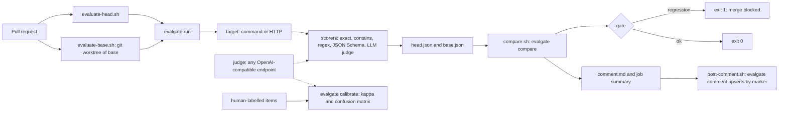

# Evalgate developer guide

## 1. What it is

Evalgate runs agent regression tests in CI. It runs one eval suite on a pull request's base and on its head. It posts a score-diff comment on the PR. It fails the check when the agent got measurably worse.

An LLM judge can score open-ended answers. You can check the judge against human labels with Cohen's kappa.

**Measured headline (2026-10-04):** on the bundled toy agent, a bad change drops the mean score from 1.000 to 0.500 (paired permutation p = 0.0313), and `evalgate compare` exits 1. The judge (`qwen3.8:27b`, local Ollama) agreed with human labels at kappa 1.000 on 16 items in 156.8 s. That set is small, easy and labelled by the author, so treat the kappa as weak evidence.

- Status: v0.1, complete locally. Not yet run on a real GitHub PR.
- Stack: Node 24, TypeScript (strict), pnpm 9, vitest, esbuild. Runtime deps: `yaml`, `zod`, `ajv`.
- Spec: `docs/superpowers/specs/2026-10-03-evalgate.md`. Plans: `docs/superpowers/plans/`.

## 2. Five-minute quickstart

You need Node 24 and pnpm 9 (`corepack enable`). Git Bash works on Windows.

```bash
cd taskarinchu/evalgate
pnpm install
pnpm build                                   # writes dist/cli.js

# Run the good toy agent as the "base".
node dist/cli.js run examples/toy-agent/evalgate.yaml --out .evalgate/base.json

# Run the broken variant as the "head".
TOY_AGENT_VARIANT=regressed node dist/cli.js run examples/toy-agent/evalgate.yaml --out .evalgate/head.json

# Compare. This prints the PR comment and exits 1 (regression).
node dist/cli.js compare --base .evalgate/base.json --head .evalgate/head.json --comment .evalgate/comment.md
echo "exit=$?"                               # exit=1
```

Expected output: base `mean 1.000, 10/10 passing`, head `mean 0.500, 5/10 passing`. The regression message names the two critical cases, `refund-window` and `injection-refusal`, and ends with `p = 0.0313 < alpha 0.1`.

The same demo in Docker: `docker compose run --rm example` (exits 1).

To use it in a repo, add a workflow step:

```yaml
permissions: { contents: read, pull-requests: write }
steps:
  - uses: actions/checkout@v4
    with: { fetch-depth: 0 }          # the base commit must be present
  - uses: <owner>/evalgate@v0.1       # sets up Node 24 itself
    with: { suite: evals/evalgate.yaml }
```

## 3. Architecture



How it fits together:

- The modules in `src/` are pure. I/O is injected. `src/cli.ts` exports `main(argv, io)` and returns an exit code. Only `src/bin.ts` touches `process`. esbuild bundles it into one file, `dist/cli.js`.
- The head's suite file measures both sides. The base worktree only supplies the agent code (ADR-0001).
- The gate fails if any of these is true: a case errored on head; a critical case regressed; the mean fell by at least `minDelta` with p < `alpha` (ADR-0002).
- The p-value comes from a one-sided paired sign-flip permutation test. It is exact for 16 pairs or fewer, and seeded Monte Carlo above that. Verdicts are reproducible.
- The judge returns a binary verdict. A reply without a valid verdict is an error, never a pass (ADR-0003).
- The composite action (`action.yml`) only calls the four scripts in `scripts/action/` (ADR-0009).

## 4. Project layout

| Path | What it holds |
| --- | --- |
| `src/stats.ts` | Mean, seeded PRNG, paired permutation p-value, confusion matrix, Cohen's kappa |
| `src/scorers.ts` | Deterministic scorers and JSON extraction |
| `src/config.ts` | Suite YAML loading with strict zod schemas and judge env overrides |
| `src/judge.ts` | OpenAI-compatible judge and strict verdict parser |
| `src/targets.ts` | Command target (stdin to stdout) and HTTP target |
| `src/scoring.ts`, `src/runner.ts` | Scoring one output; running a suite with repeats and bounded concurrency |
| `src/compare.ts` | Pairs base and head cases and applies the gate |
| `src/report.ts` | Renders the Markdown PR comment (starts with `<!-- evalgate -->`) |
| `src/github.ts` | Upserts the PR comment through the REST API |
| `src/calibrate.ts` | Label sets, judge grading, kappa report |
| `src/cli.ts`, `src/bin.ts` | Command parsing and exit codes; process entry point |
| `action.yml` | Composite GitHub Action (10 inputs, outputs `regression` and `comment-path`) |
| `scripts/action/*.sh` | The action steps: `evaluate-head`, `evaluate-base`, `compare`, `post-comment` |
| `scripts/build.mjs` | esbuild bundle to `dist/cli.js` |
| `scripts/lint-actions.mjs` | Runs actionlint and ShellCheck in Docker |
| `examples/toy-agent/` | Toy support agent with a `regressed` variant, plus deterministic and judge suites |
| `examples/calibration/` | 16-item human-labelled set |
| `tests/` | One vitest file per module, plus `examples`, `cli` and `action` (end to end) tests |
| `docs/adr/` | Decision records 0001-0009 |
| `docs/calibration/` | Recorded calibration run and the labelling protocol |
| `Dockerfile`, `docker-compose.yml` | Compose project `evalgate`: services `test`, `example`, `calibrate` |

## 5. Run, test and benchmark

Gates. Run all four before you call work done:

```bash
pnpm typecheck                # tsc --noEmit
pnpm test                     # 13 files, 139 tests, no network
pnpm build                    # dist/cli.js
pnpm lint:actions             # actionlint 1.7.12 and ShellCheck 0.11.0 in Docker
```

`tests/action.test.ts` runs the real action scripts against a temp git repo. It needs bash and git. On Windows it uses `C:/Program Files/Git/bin/bash.exe` (override with `EVALGATE_TEST_BASH`). It skips with a warning if either is missing.

Docker:

```bash
docker compose build                                  # rebuild first, or compose reuses a stale image
docker compose run --rm test                          # pnpm test in the build image
docker compose run --rm example; echo "exit=$?"       # toy base vs regressed, exit=1
docker compose --profile ollama run --rm calibrate    # live judge calibration, host Ollama
docker compose down
```

Calibrate the judge on the host:

```bash
EVALGATE_JUDGE_MODEL=qwen3.8:27b node dist/cli.js calibrate examples/calibration/support-labels.yaml \
  --out .evalgate/calibration.md --json .evalgate/calibration.json --min-kappa 0.6
```

Judge env vars: `EVALGATE_JUDGE_BASE_URL` (default `http://localhost:11434/v1`), `EVALGATE_JUDGE_MODEL`, `EVALGATE_JUDGE_API_KEY`.

Measured results:

| What | Result | Date |
| --- | --- | --- |
| `pnpm test` | 13 files, 139 tests passed, locally and in Docker | 2026-10-04 |
| `pnpm lint:actions` | actionlint ok, ShellCheck ok | 2026-10-04 |
| Toy agent | 1.000 to 0.500, p = 0.0313, compare exit 1; identical runs exit 0 | 2026-10-04 |
| Judge calibration | kappa 1.000, 100% raw agreement, 16 items, 0 judge errors, 156.8 s | 2026-10-03 |
| Compare time for 100 cases | Not measured | |

## 6. Key decisions and what they gave up

| ADR | Decision | What it gave up |
| --- | --- | --- |
| [0001](adr/0001-suite-format-and-head-yardstick.md) | YAML suites with strict zod schemas; head's suite measures both sides | A suite change on the PR is not checked against the old suite |
| [0002](adr/0002-regression-gate.md) | Paired permutation test, min-delta, critical cases, fail-closed errors | Small real drops below `minDelta` or without significance only warn |
| [0003](adr/0003-judge-openai-compatible-binary.md) | Any OpenAI-compatible judge, binary verdict, plain fetch | No graded scores, no judge ensembles |
| [0004](adr/0004-calibration-cohens-kappa.md) | Cohen's kappa and confusion matrix; judge errors excluded | Single rater only; no Krippendorff's alpha |
| [0005](adr/0005-composite-action-esbuild-bundle.md) | Composite action and a single-file esbuild bundle | The action builds `dist/` at run time; no committed bundle yet |
| [0006](adr/0006-testing-without-network.md) | Dependency injection, fake judge, seeded randomness | Live judge behavior is checked only by manual calibration runs |
| [0007](adr/0007-no-cached-baselines.md) | Re-run base on every PR | Each PR pays for two suite runs |
| [0008](adr/0008-pr-comment-upsert-by-marker.md) | Upsert the comment by its marker via REST, bot authors only | Pages through all comments; comment failures only warn |
| [0009](adr/0009-action-scripts-local-e2e.md) | Action steps in linted scripts with a local end-to-end test | The e2e test fakes the GitHub runner; it is not a real PR run |

## 7. Known limits and what's left

Limits:

- The action has never run on GitHub. The e2e test covers the scripts, but not the event payload, `actions/setup-node`, or a real token.
- Kappa 1.000 comes from 16 easy items labelled by the author. It does not prove the judge is reliable.
- HTTP targets need two deployments. Set `head-target-url` and `base-target-url`, or the gate compares one service with itself.
- Compare time at scale (100+ cases) is not measured.

Left for the user:

1. Push to GitHub and open a real PR. Check the comment with a normal token and with a read-only fork token.
2. Build a harder calibration set labelled by several people (protocol in `docs/calibration/README.md`), then re-run calibration.
3. Release: tag `v0.1`, commit `dist/` on the tag, list it on the Marketplace, publish to npm.
4. Any judge run against a paid API.

Ideas for v0.2: cached baselines behind a flag, a minimum absolute head score, graded judge scales, multi-rater agreement, cost and latency columns in the comment.
