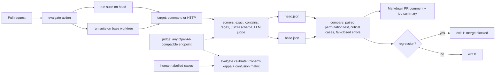

# Evalgate developer documentation

Agent regression tests in CI. Evalgate runs an eval suite on a pull request's base and head, posts a score-diff comment, and fails the check when the agent got measurably worse. Its LLM judge is calibrated against human labels with Cohen's kappa.

- Repository: `taskarinchu/evalgate`
- Status: v0.1 shipped locally (all 14 plan tasks done; 112 tests passing; not yet run on GitHub Actions)
- Stack: Node 24, TypeScript 5 (strict), pnpm 9, vitest, esbuild, zod, ajv, yaml
- Spec: `docs/superpowers/specs/2026-10-03-evalgate.md`
- Plan: `docs/superpowers/plans/2026-10-03-evalgate.md`

## 1. Overview and goals

Most teams evaluate agents by hand, or run evals in CI without a baseline or a noise model, so prompt changes that make the agent worse get merged. Evalgate turns an eval suite into a merge gate.

Profile thesis: **the model proposes, the deterministic core disposes.** The LLM judge only proposes pass/fail verdicts. A deterministic gate with declared limits decides the merge, and every limit is pinned by a test. The limits are the minimum delta, the significance level, critical cases, and failing closed on errors.

Goals for v0.1:

1. Declare an eval suite in YAML: cases, a target (a command or an HTTP endpoint), and scorers.
2. Score with deterministic scorers (exact, contains, not-contains, regex, JSON Schema) and an LLM judge served by any OpenAI-compatible endpoint. The dev default is local Ollama at `http://localhost:11434/v1` with `qwen3.8:27b`.
3. Run on base and head, compute per-case and aggregate deltas, and apply a significance and noise threshold.
4. Post a Markdown PR comment with a score-diff table, and exit non-zero on regression.
5. `evalgate calibrate` measures judge-human agreement (Cohen's kappa plus a confusion matrix).
6. Ship as a CLI, a composite GitHub Action and Docker images.

Non-goals for v0.1: npm publishing, a Marketplace listing, cached baselines, graded 1-10 judge scales, multi-judge ensembles, dashboards.

## 2. Architecture



The modules are pure, and their I/O is injected. `src/cli.ts` exposes `main(argv, io)`, which returns an exit code. `src/bin.ts` is the only file that touches `process`, and esbuild bundles it into `dist/cli.js`.

## 3. Components and responsibilities

| Module | Responsibility |
| --- | --- |
| `src/types.ts` | Shared types: suite specs, results, `FetchLike` |
| `src/stats.ts` | `mean`, seeded PRNG `mulberry32`, one-sided paired sign-flip permutation p-value, confusion matrix, Cohen's kappa |
| `src/scorers.ts` | Deterministic scorers, JSON Schema compile and cache (ajv), JSON extraction from output (including fenced blocks) |
| `src/config.ts` | Parses and validates suite YAML with zod strict schemas; duplicate id, regex and JSON Schema checks; judge env overrides |
| `src/judge.ts` | OpenAI-compatible chat-completions judge, prompt builder, strict verdict parser (strips `<think>` blocks) |
| `src/targets.ts` | Command target (stdin to stdout, timeout, env, cwd) and HTTP target (POST JSON, `outputPath`, `${ENV}` header expansion) |
| `src/scoring.ts` | Applies a case's scorers to an output, routing `llm-judge` scorers to the judge |
| `src/runner.ts` | Runs a suite with repeats and bounded concurrency; turns errors into `score: null` |
| `src/compare.ts` | Pairs base and head cases, assigns case statuses, applies the gate, produces failures and warnings |
| `src/report.ts` | Renders the Markdown PR comment |
| `src/calibrate.ts` | Label-set parsing, sequential judge grading, kappa report and Markdown rendering |
| `src/cli.ts` / `src/bin.ts` | Command parsing and exit codes / process entry point |
| `action.yml` | Composite action: build, head run, base worktree run, compare, comment, gate |
| `examples/` | Toy support agent (with a `regressed` variant), deterministic and judge suites, 16-item labelled set |
| `Dockerfile`, `docker-compose.yml` | Containerized test, example and calibration runs (Ollama stays on the host) |

## 4. Data model: suite YAML schema

```yaml
name: toy-support-agent           # required
target:                           # required; command or http
  type: command
  command: node                   # "node" resolves to the running node binary
  args: [agent.mjs]
  cwd: .                          # relative to --workdir (default: suite file directory)
  env: {}                         # merged over the parent environment
  timeoutMs: 30000
# target:
#   type: http
#   url: http://localhost:8787/chat
#   headers: { Authorization: "Bearer ${TOKEN}" }   # ${ENV} expanded at run time
#   inputField: input             # request body is {"<inputField>": "<case input>"}
#   outputPath: output.text       # dotted path into the JSON response; raw text if omitted
#   timeoutMs: 30000
judge:                            # optional; defaults apply when any case uses llm-judge
  baseUrl: http://localhost:11434/v1     # env EVALGATE_JUDGE_BASE_URL
  model: qwen3.8:27b                     # env EVALGATE_JUDGE_MODEL
  apiKeyEnv: EVALGATE_JUDGE_API_KEY      # name of the env var holding the key
  temperature: 0
  timeoutMs: 120000
  extraBody: {}                          # merged into the request body
repeats: 1                        # 1..20
concurrency: 4                    # 1..32
gate:
  minDelta: 0.02                  # 0..1
  alpha: 0.1                      # (0, 1]
  caseThreshold: 0.5              # (0, 1]
  permutations: 10000             # Monte Carlo draws when more than 16 pairs
  seed: 42
cases:
  - id: refund-window             # [A-Za-z0-9._-]+, unique
    input: "How long do I have to get a refund?"
    expected: "30 days"           # optional; shown to the judge as a reference
    critical: true                # any regression fails the gate
    scorers:                      # at least one
      - { type: contains, value: "30 days" }              # string or list; all must appear
      - { type: not-contains, value: [STAFF50] }          # none may appear
      - { type: exact, value: "42", caseSensitive: true } # trimmed comparison
      - { type: regex, pattern: "^Hi!", flags: "i" }
      - { type: json-schema, schema: { type: object } }
      - { type: llm-judge, rubric: "PASS if ..." }
```

Unknown keys are rejected everywhere.

Results file (`schemaVersion: 1`):

| Field | Meaning |
| --- | --- |
| `suite`, `gate`, `startedAt`, `finishedAt` | Run metadata; `gate` is used by compare |
| `cases[].score` | Mean over scorers and repeats, 0..1; `null` if any repeat errored |
| `cases[].passRate` | Share of repeats where every scorer passed |
| `cases[].repeats[]` | Output, latency, per-scorer results, error |
| `summary` | `cases`, `scored`, `errored`, `passing`, `meanScore` (over scored cases) |

Label set (calibration):

```yaml
name: support-policy
judge: { model: qwen3.8:27b }      # optional, same schema as suites
rubric: "default rubric"           # used when an item has none
items:
  - { id: refund-correct, input: "...", output: "...", expected: "...", label: pass }
```

## 5. Public API: CLI and Action

### CLI

| Command | Purpose | Exit codes |
| --- | --- | --- |
| `evalgate run <suite.yaml> [--out f.json] [--workdir dir] [--repeats n] [--target-url url]` | Run a suite and write results JSON (to stdout without `--out`); prints one progress line per case to stderr | 0, or 2 on a usage or config error |
| `evalgate compare --base b.json --head h.json [--comment c.md] [--min-delta x] [--alpha x] [--case-threshold x]` | Print the PR comment Markdown; flags override the head's gate | 0 no regression, 1 regression, 2 error |
| `evalgate calibrate <labels.yaml> [--out r.md] [--json r.json] [--min-kappa x]` | Judge-human agreement report | 0, 1 if kappa is below `--min-kappa`, 2 error |

### Environment

| Variable | Effect |
| --- | --- |
| `EVALGATE_JUDGE_BASE_URL` | Overrides `judge.baseUrl` |
| `EVALGATE_JUDGE_MODEL` | Overrides `judge.model` |
| `EVALGATE_JUDGE_API_KEY` (or the name set in `apiKeyEnv`) | Sent as `Authorization: Bearer ...` |

### GitHub Action inputs and outputs

| Input | Default | Meaning |
| --- | --- | --- |
| `suite` | required | Suite path relative to the repository root |
| `base-ref` | PR base SHA | Ref to compare against |
| `base-setup` | empty | Shell command run in the base checkout first (for example `npm ci`) |
| `min-delta`, `alpha`, `case-threshold` | empty | Gate overrides |
| `comment` | `true` | Post or edit the PR comment |
| `github-token` | `github.token` | Token used for the comment |

| Output | Meaning |
| --- | --- |
| `regression` | `"true"` if the gate failed |
| `comment-path` | Path of the rendered Markdown |

The workflow needs `actions/checkout` with `fetch-depth: 0` and `pull-requests: write` permission.

## 6. Key flows

### Base vs head run

1. The action builds evalgate if `dist/cli.js` is missing.
2. `evalgate run <suite> --out head.json` runs in the PR checkout.
3. `git worktree add --detach $RUNNER_TEMP/evalgate-base <base-sha>`, then the optional `base-setup` command.
4. `evalgate run <suite> --workdir <base-worktree>/<suite dir> --out base.json`. The suite file always comes from head, so both sides are measured by the same yardstick (ADR-0001).
5. `evalgate compare` pairs cases by id. It computes diffs, the mean delta and the one-sided paired permutation p-value (exact for 16 pairs or fewer, seeded Monte Carlo above), then assigns statuses: regressed, improved, unchanged, added, removed or error.
6. The gate fails if any of these hold: a case errored on head; a critical case regressed; the mean delta is at most -minDelta and p < alpha.

### PR comment

The comment begins with the marker `<!-- evalgate -->`. It contains a PASS or FAIL header, a metrics table (mean score, cases passing), the paired delta and p-value with the gate settings, Blocking and Warnings lists, a changed-cases table, and a collapsed table of unchanged cases. The action appends it to the job summary and posts it with `gh pr comment --edit-last`, falling back to a new comment, and only warns on fork PRs.

### Calibrate

1. Load the label set and resolve the judge (YAML, then env overrides).
2. Grade the items one at a time, since the judge is often a shared local model. Judge errors are recorded and left out of the kappa.
3. Compute the confusion matrix (rows human, columns judge), Cohen's kappa (`null` with only one class), raw agreement, a Landis & Koch label and the duration.
4. Render Markdown with the disagreements. `--min-kappa` turns this into a CI check.

## 7. Limits and invariants, and how tests enforce them

| Invariant | Enforced by |
| --- | --- |
| A case that errored on head fails the gate; errors never become score 0 | `tests/runner.test.ts` ("marks target failures as errors"), `tests/compare.test.ts` ("fails closed when a case errored on head") |
| Any regression of a critical case fails the gate | `tests/compare.test.ts` ("fails any regression of a critical case") |
| An aggregate drop fails only if delta <= -minDelta and p < alpha; otherwise it is a "noise" warning | `tests/compare.test.ts` (significant drop, noise, gate overrides) |
| p-values are exact (16 pairs or fewer) or seeded, so verdicts are reproducible | `tests/stats.test.ts` (1/8, 1/32, Monte Carlo determinism) |
| Identical runs give p = 1, delta `0.000` (never `-0.000`), exit 0 | `tests/stats.test.ts`, `tests/report.test.ts`, `tests/cli.test.ts` |
| A judge reply without a valid verdict is an error, never a pass | `tests/judge.test.ts`, `tests/runner.test.ts` |
| Invalid suites (unknown keys, duplicate ids, bad regex or JSON Schema, out-of-range gate values) exit 2 before any target runs | `tests/config.test.ts`, `tests/cli.test.ts` |
| A target timeout or non-zero exit is reported with its reason | `tests/targets.test.ts` |
| Kappa is undefined (`null`, shown as "n/a") with one class; errors are excluded | `tests/stats.test.ts`, `tests/calibrate.test.ts` |
| `--min-kappa` is enforced | `tests/cli.test.ts` |
| Unit tests never reach the network | Injected `fetch`; the CLI test fetch throws "network disabled in tests" |

## 8. Local development setup and exact commands

Prerequisites: Node 24, pnpm 9 (`corepack enable`), Docker Desktop. Ollama on the host is needed only for live calibration.

```bash
cd taskarinchu/evalgate
pnpm install
pnpm typecheck
pnpm test
pnpm build
node dist/cli.js run examples/toy-agent/evalgate.yaml --out .evalgate/base.json
TOY_AGENT_VARIANT=regressed node dist/cli.js run examples/toy-agent/evalgate.yaml --out .evalgate/head.json
node dist/cli.js compare --base .evalgate/base.json --head .evalgate/head.json --comment .evalgate/comment.md   # exits 1
```

Docker (the user rule is that everything runs in containers; there is no AWS, so no LocalStack):

```bash
docker compose build
docker compose run --rm test                      # pnpm test in the build image
docker compose run --rm example                   # base vs regressed demo, exits 1
docker compose --profile ollama run --rm calibrate   # live judge calibration via host.docker.internal:11434
```

## 9. Testing strategy

- TDD with vitest, with one test file per module plus `examples.test.ts` (runs the real toy agent) and `cli.test.ts` (in-process `main()` with injected `Io`).
- No network: the judge and HTTP targets get fake `fetch` functions, and `fakeJudge` covers runner and calibration tests.
- Real processes where it matters: command-target tests spawn the node binary to exercise timeouts, exit codes, env and cwd.
- Deterministic statistics: exact enumeration or a fixed seed, so assertions use exact values (for example `p = 1/32`).
- CI (`.github/workflows/ci.yml`) runs typecheck, tests, build, and a smoke test that asserts the regressed toy agent makes `compare` exit 1.
- Live checks are manual: one `evalgate calibrate` run against local Ollama, recorded in `docs/calibration/`.

## 10. Metrics plan (targets only; results are filled in from real runs)

| Metric | Target | How it is measured |
| --- | --- | --- |
| Unit and integration tests | All green, no network | `pnpm test` totals |
| Toy agent regression detection | Regressed variant fails the gate; identical runs pass | `evalgate compare` exit codes |
| Judge-human agreement | kappa >= 0.6 (substantial) on the 16-item set | `evalgate calibrate` with `qwen3.8:27b` |
| Calibration run time | Under 20 minutes for 16 items on the local model | `durationMs` in the calibration report |
| Gate overhead | Compare under 1 s for 100 cases | Timing `evalgate compare` (stretch) |

Results (measured, 2026-10-03):

- Tests: `pnpm test` gives `Test Files  11 passed (11)` and `Tests  112 passed (112)`, locally and in Docker (`docker compose run --rm test`).
- Toy agent: baseline `mean 1.000, 10/10 passing`; regressed `mean 0.500, 5/10 passing`; `compare` exits 1 (p = 0.0313), and exits 0 on identical runs.
- Judge-human agreement: kappa 1.000 (raw agreement 100.0%, 16 scored, 0 judge errors) with `qwen3.8:27b`.
- Calibration run time: 156.8 s for 16 items.
- Gate overhead (compare under 1 s for 100 cases): not measured.

## 11. Milestones

v0.1 (one commit per task, see the plan):

- [x] Spec, ADRs, plan, dev docs
- [x] Task 1: toolchain + statistics core (permutation test, kappa)
- [x] Task 2: shared types + deterministic scorers
- [x] Task 3: suite config loader (zod strict)
- [x] Task 4: OpenAI-compatible judge
- [x] Task 5: command and HTTP targets
- [x] Task 6: scoring + suite runner
- [x] Task 7: base-vs-head comparison (gate)
- [x] Task 8: Markdown PR comment
- [x] Task 9: judge calibration
- [x] Task 10: toy agent, example suites, labelled set
- [x] Task 11: CLI + process entry
- [x] Task 12: bundle, GitHub Action, workflows
- [x] Task 13: Docker (compose services: test, example, calibrate)
- [x] Task 14: README, live calibration (optional), handoff

Stretch (v0.2+):

- Cached baselines from `main`, behind a flag (ADR-0007 trade-off)
- Committed `dist/` on release tags and a Marketplace listing
- Multi-rater agreement (Krippendorff's alpha) and per-rubric kappa
- Cost and latency columns in the PR comment
- Gating Tollgate and the ServerlessAgent construct in CI with Evalgate

## 12. Decisions

| ADR | Decision |
| --- | --- |
| [ADR-0001](adr/0001-suite-format-and-head-yardstick.md) | YAML suites validated with zod; the head's suite is the yardstick for both sides |
| [ADR-0002](adr/0002-regression-gate.md) | Paired sign-flip permutation test + min-delta + critical cases + fail-closed errors |
| [ADR-0003](adr/0003-judge-openai-compatible-binary.md) | Judge: any OpenAI-compatible endpoint, binary verdict, plain fetch |
| [ADR-0004](adr/0004-calibration-cohens-kappa.md) | Calibration: Cohen's kappa + confusion matrix, errors excluded, `--min-kappa` |
| [ADR-0005](adr/0005-composite-action-esbuild-bundle.md) | Composite GitHub Action + single-file esbuild bundle |
| [ADR-0006](adr/0006-testing-without-network.md) | Tests: dependency injection, no network, fake judge, seeded randomness |
| [ADR-0007](adr/0007-no-cached-baselines.md) | Re-run base on every PR; no stored baselines |

## 13. Open questions

1. Should the gate support a minimum absolute head score (for example "mean >= 0.8") in addition to the base-relative checks?
2. Is `gh pr comment --edit-last` precise enough, or should v0.2 find its own comment by the `<!-- evalgate -->` marker through the REST API?
3. For HTTP targets, how should the base deployment be provisioned in CI (preview environments, or starting the service from the base worktree with `base-setup`)?
4. Should `qwen3.8:27b` run with reasoning disabled (`extraBody: { reasoning_effort: none }`) by default, if live calibration shows similar kappa at much lower latency?
5. Are 16 author-labelled items enough to quote kappa publicly, or should the README wait for a larger set labelled by several people?
